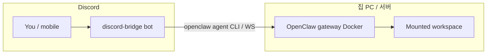

# Discord ↔ OpenClaw 브리지 (A→Z)

집(또는 서버)에 **OpenClaw 게이트웨이(Docker)** 를 두고, **디스코드**는 “말로 시키고·로그를 보는” 앞단으로 쓰는 구성입니다. 이 폴더는 그 사이를 잇는 **봇 + 오케스트레이션(클로드 수정 ↔ 재미나이 검토)** 뼈대입니다.

---

## 한눈에 정리 — 무엇이 무엇인가

| 이름 | 실체 | 하는 일 |
|------|------|--------|
| **OpenClaw (Docker)** | 집 PC에서 도는 **게이트웨이** | API 키로 클로드·재미나이 호출, (설정에 따라) 마운트된 **워크스페이스 폴더**에 도구로 파일 수정 |
| **`openclaw/.env`** | 게이트웨이용 비밀 | `ANTHROPIC_API_KEY`, `GEMINI_API_KEY` 등, **`OPENCLAW_GATEWAY_TOKEN`** |
| **이 봇 (`discord-bridge`)** | Node.js 프로세스(호스트에서 실행) | **@한 봇**에 맞는 OpenClaw `agents.list` id로 호출(재미나이 봇 = `discord-gemini`, 클로드 봇 = `discord-claude`). 코딩 루프는 **같은 프로필**로 편집↔검수 둘 다 돎 |
| **`discord-bridge/.env`** | 봇용 비밀 | **`DISCORD_TOKEN_GEMINI`** (첫 봇), 선택 **`DISCORD_TOKEN_CLAUDE`**, **`OPENCLAW_GATEWAY_TOKEN`**, 채널 ID 등 (`DISCORD_TOKEN` 이름도 호환) |
| **잼민이(표시 이름)** | 디스코드에서 보이는 **봇 닉네임** | 포털/서버에서 이름만 바꾸면 됨. 코드에 “잼민이” 문자열을 넣지 않아도 **`@표시이름`** 은 동작함(멘션 = 봇 **사용자 ID**) |

---

## 어떻게 동작하나 (사용자 입장)

1. 디스코드에서 봇 이름을 **잼민이**처럼 보이게 해 둠.
2. **`@잼민이 이거 좀 해줘`** 처럼 **멘션 + 할 말**을 보냄.  
   - 또는 봇이 보낸 메시지에 **답장**만 해도 됨(같은 스레드에서 `@` 생략 가능).

   **규칙을 “채팅으로 한 번”만 말해두면?** 그 메시지는 **다음 멘션에서 자동으로 모델에 안 들어갑니다.** (대화 기록을 봇이 계속 들고 가지 않기 때문입니다.) 대신 **채널 우클릭 → 채널 편집 → 채널 주제(토픽)** 에  
   `여기서는 주로 코딩 작업. 파일 수정은 명시적으로 경로/요청 적기` 처럼 적어 두면, 브리지가 **매 멘션마다** 그 토픽을 프롬프트에 붙입니다.  
   서버 설명까지 넣고 싶으면 `.env`에 `DISCORD_APPEND_GUILD_DESCRIPTION=1` (길면 `DISCORD_GUILD_DESCRIPTION_MAX_CHARS`로 잘림). 디스코드 **커뮤니티 규칙 채널 본문**은 API로 한 방에 못 읽는 경우가 많아서, 중요한 한 줄은 토픽이나 서버 설명 쪽이 더 맞습니다.

3. **채널로 역할을 고정(권장):** `.env`에 `CHAT_CHANNEL_IDS` / `SEARCH_CHANNEL_IDS` / `CODING_CHANNEL_IDS` 에 채널 ID를 넣으면, 그 채널에서는 **역할이 명확**해짐(말동무=항상 단발 대화, 검색=항상 단발 검색 톤, 코딩=`CODING_CHANNEL_MODE`에 따라 단발 분류 또는 항상 루프). 요청마다 “무슨 의도인지”를 맞출 필요가 줄어듦.
4. **세 목록이 모두 비어 있으면** 모든 채널에서 **`DEFAULT_MENTION_MODE`**(기본 `auto`)와 **문장 분류**만으로 단발/루프를 갈림.
5. **한 채널 ID가 두 목록 이상에 들어가 있으면** `CHANNEL_LIST_OVERLAP_PRIORITY`(예: `coding,search,chat`)로 **어느 역할이 이길지** 정함.
6. 모든 OpenClaw 호출 앞에 **서버·채널 이름 + 위에서 정한 역할** 한 줄 요약이 붙어, 모델이 “지금 어떤 채널인지” 인지함.
7. 봇은 컨테이너 안에서 **`openclaw agent` CLI**(게이트웨이 WebSocket)로 요청을 보냅니다. 도커에서는 `OPENCLAW_GATEWAY_URL=ws://openclaw-gateway:18789` 를 씁니다.

---

## 전체 그림

- **격리:** 실제 코딩·도구는 OpenClaw(도커) 쪽 정책. 봇은 그저 “디스코드 ↔ 게이트웨이” **중계기**에 가깝습니다.
- **두뇌·API 키:** OpenClaw 컨테이너가 갖고 있는 것이 기준입니다.

---

## 구성 요소 역할 (파일)

| 파일 | 역할 |
|------|------|
| **`src/index.js`** | 멘션/답장 감지, 채널별 모드, 스레드 생성, 디스코드 답장 |
| **`src/orchestrator.js`** | 편집자 ↔ 검토자 라운드, `VERDICT:` 파싱, 교착·라운드 상한 |
| **`src/prompts.js`** | 역할 분리 문구, 검토자는 마지막 줄에 `VERDICT:` 강제 |
| **`src/openclaw-client.js`** | `node /app/openclaw.mjs agent …` 로 게이트웨이에 한 턴 요청 |

---

## 알고리즘(티키타카) 요약

1. 유저가 **어느 봇**을 @했는지에 따라 게이트웨이 `agents.list`의 그 프로필이 쓰임(재미나이/클로드 **동급**).
2. (코딩 모드면) **스레드** 생성. **라운드 N:** 편집자·검토자 모두 **그 봇이 쓰는 동일 OpenClaw 에이전트**(프롬프트만 “편집/검토” 역할 분리).
3. 검토자는 끝에 `VERDICT: APPROVE | NEEDS_WORK | BLOCKED` (`prompts.js`).
4. **APPROVE** → 완료. **BLOCKED** → 중단. **NEEDS_WORK** 반복이 **같은 지문**이면 교착 처리. **MAX_ROUNDS** 초과 시 중단.

`npm run orchestrator-demo` 로 루프만 로컬 검증.

---

## 당신이 해야 할 일 — 순서대로

### A. OpenClaw (이미 하셨을 수 있음)

1. `c:\my_AI_agent\openclaw` 에서 `docker compose up -d`
2. `openclaw/.env` 에 API 키 + **`OPENCLAW_GATEWAY_TOKEN`** (대시보드와 동일)
3. 브라우저에서 대시보드가 붙는지 확인

### B. 봇을 “잼민이”로 보이게

1. [Discord Developer Portal](https://discord.com/developers/applications) → 앱 선택
2. 앱 이름/Bot username 변경 **또는** 서버에서 봇 우클릭 → **서버 닉네임** → `잼민이`
3. **Bot** → **Token** → `discord-bridge/.env` 의 `DISCORD_TOKEN_GEMINI` 등 (채팅에 절대 붙이지 말 것)
4. **Privileged Gateway Intents** → **Message Content Intent** 켜기
5. OAuth2 초대 링크로 서버에 봇 추가 (스레드·메시지 전송 권한 포함)

### C. `discord-bridge/.env`

1. `copy .env.example .env`
2. `DISCORD_TOKEN_GEMINI`(또는 `DISCORD_TOKEN`), `OPENCLAW_GATEWAY_TOKEN`, `OPENCLAW_BASE_URL` (보통 `http://127.0.0.1:18789`)
3. `#coding` / `#search` 채널 ID를 `CODING_CHANNEL_IDS`, `SEARCH_CHANNEL_IDS`에 넣기(운영 권장)
4. `npm install` → `npm start` (Node 20+)

### D. 연결 확인

- 검색 채널: `@잼민이 오늘 날씨 서울` 같은 **단발** 질문
- 코딩 채널: `@잼민이 README에 한 줄 추가해줘` → **스레드**에 라운드 로그가 쌓이는지 확인

직접 WS 프로토콜을 구현할 필요는 없고, OpenClaw 이미지에 포함된 CLI를 호출하는 방식입니다.

---

## 보안·운영

- 게이트웨이를 공인 인터넷에 직접 열지 말 것. 모바일은 **Tailscale** 등 권장.
- 토큰·API 키는 **`.env`만**.
- 봇은 호스트에서 돌아감 — 봇이 해킹당하면 **게이트웨이 토큰**도 위험해지므로, 가능하면 봇·게이트웨이 모두 **집 네트워크 안**에서만 쓰기.

---

## GitHub Actions · GHCR 이미지

`main`에 `discord-bridge/**` 변경이 푸시되면 루트의 `.github/workflows/publish-discord-bridge.yml`이 `discord-bridge` Docker 이미지를 빌드해 **ghcr.io**에 올립니다. 태그 예: `discord-bridge`, `discord-bridge-latest`, `discord-bridge-<커밋 sha>`.

- 이미지: `ghcr.io/<github 사용자 또는 org>/<저장소 이름 lower>:discord-bridge-latest` (실제 풀 주소는 GitHub **Packages** 탭에서 확인)
- `openclaw/docker-compose.yml`의 `discord-bridge` 서비스에서 `build:` 대신 위 `image:`를 쓰면 로컬 `docker build` 없이 쓸 수 있음(비공개 저장소/패키지면 `docker login ghcr.io` + 읽기 권한 필요)

---

## 다음 확장 아이디어

- WS 기반 게이트웨이 클라이언트로 교체
- 완료/교착 시 유저 `@멘션`
- 클로드 전용 봇 / 재미나이 전용 봇 **둘로 나누기**(지금은 **한 봇**이 모드만 바꿔 호출)
